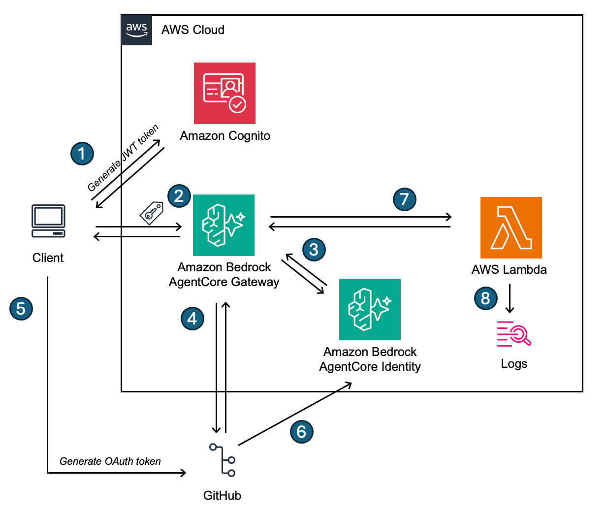
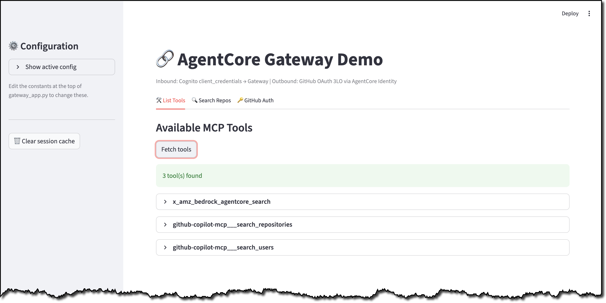
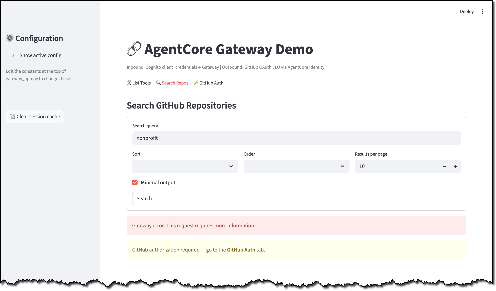
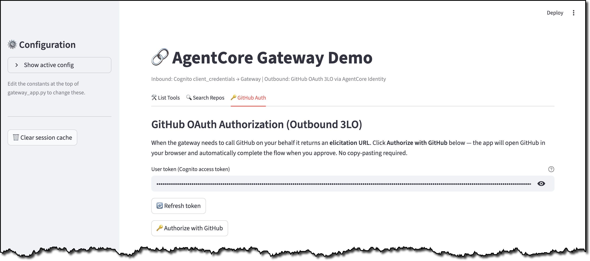
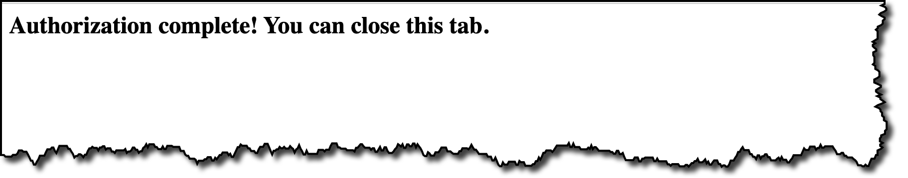
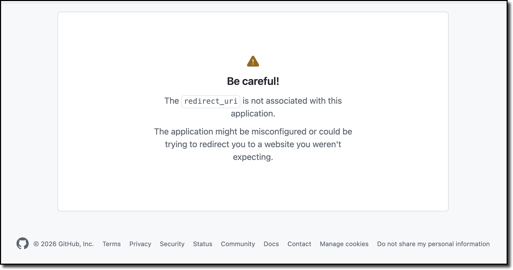
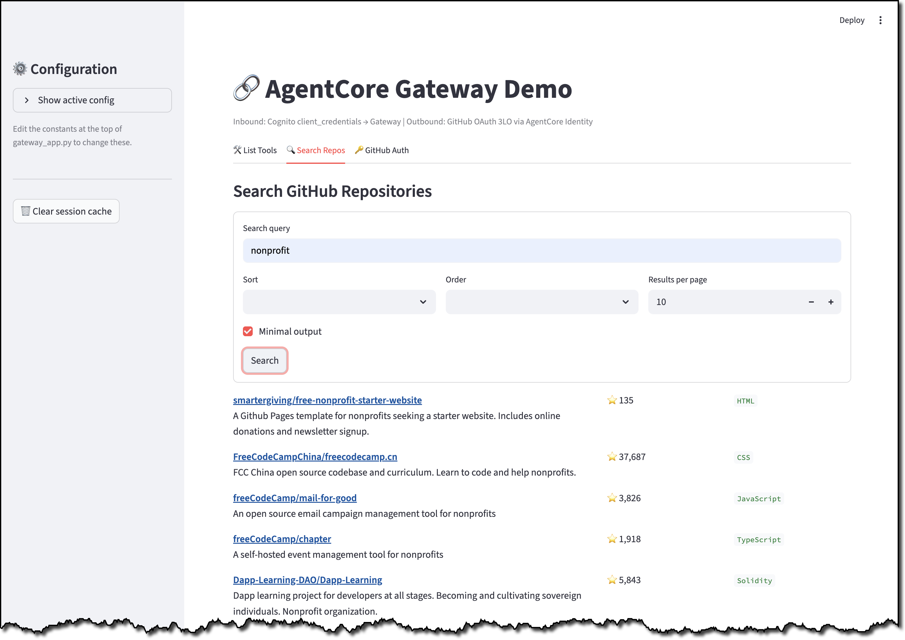

# AgentCore Gateway Demo

A Streamlit app that demonstrates an Amazon Bedrock AgentCore Gateway using the MCP protocol, with inbound Cognito JWT auth and outbound GitHub OAuth (3-legged OAuth) via AgentCore Identity. The Gateway also uses a Lambda outbound interceptor, so you could potentially capture results from the MCP tools and modify them before returning to the client.

## Architecture

- **`gateway-with-interceptor.yaml`** — CloudFormation template that deploys the full stack: Cognito user pool, AgentCore Gateway, GitHub OAuth credential provider, Lambda response interceptor, and a custom resource Lambda to manage the gateway target.
- **`gateway_app.py`** — Streamlit demo app that connects to the deployed gateway.

The solution works as follows:
- The client needs to make a call to AgentCore Gateway, but first needs an authentication token. It calls Cognito to get a JWT (see 1)
- The client uses this token to call AgentCore Gateway, passing in the token it received from the prior step (see 2)
- The client wants to use the GitHub MCP server, so AgentCore Gateway attempts to pull the authentication information from AgentCore Identity (see 3). It determines there is no OAuth token, so it returns the authentication endpoint to the client.
- The client performs authentication against the OAuth endpoint (see 5). The OAuth application returns the OAuth token (see 6). The client then associates the JWT and the OAuth token via the `complete_resource_token_auth` API and sends the results to the AgentCore control plane.
- The client makes a new request to the MCP server (see 2), AgentCore Gateway successfully pulls the OAuth token from AgentCore Identity (see 3) and makes the request to the external MCP server (see 4). 
- The results are returned, but before AgentCore Gateway returns the results to the client, it sends the results to the Gateway's response interceptor (see 7). The Lambda function writes the results to a log file (see 8).
- The results are returned from the response interceptor and the Gateway returns the results to the client.




## Prerequisites

- Python 3.12+
- AWS CLI configured with credentials for the target account
- A deployed stack from `gateway-with-interceptor.yaml`
- A GitHub OAuth App with the AgentCore callback URL registered

---

## 1. Create a GitHub OAuth application
1. Login to GitHub and go to your OAuth apps in [Developer Settings](https://github.com/settings/developers). 

2. Click **New OAuth App**. GIve your application a name (for example `github-oauth`), the homepage URL (example: `http://localhost:8080`). Put the same URL in for the **Authorization callback URL** (we'll be changing this shortly). Click **Register application**

3. On the screen that appears click **Generate a new client secret**. Copy the `Client ID` and `Client secret`.

## 2. Deploy the Stack

Use the `Client ID` and `Client secret` from the previous step.

```bash
aws cloudformation deploy \
  --template-file gateway-with-interceptor.yaml \
  --stack-name gateway-interceptor \
  --region <YOUR REGION> \
  --capabilities CAPABILITY_NAMED_IAM \
  --parameter-overrides \
      GatewayName=my-agentcore-gateway \
      GitHubClientId=<your-github-oauth-app-client-id-from-above> \
      GitHubClientSecret=<your-github-oauth-app-client-secret-from-above>
```

After deploy, grab the outputs — you'll need them to configure the app:

```bash
aws cloudformation describe-stacks \
  --stack-name gateway-interceptor \
  --region <YOUR REGION> \
  --query 'Stacks[0].Outputs' \
  --output table
```

## 3. Update the OAuth application

Copy the value of `GitHubOAuthCallbackUrl` from the stack output and paste it back into the **Authorization callback URL** from Step 1. Click **Update application**.

## 4. Configure and run gateway_app.py

Open `gateway_app.py` and edit the constants block near the top of the file. The constants are all available in the CloudFormation stack output (with the exception of `COGNITO_CLIENT_SECRET`)

```python
# ---------------------------------------------------------------------------
# Configuration — edit these values to point at your deployed stack
# ---------------------------------------------------------------------------
AWS_REGION              = "<YOUR REGION>"
COGNITO_CLIENT_ID       = "<CognitoUserPoolClientId from stack outputs>"
COGNITO_CLIENT_SECRET   = "<client secret — see below>"
COGNITO_HOSTED_URL      = "<CognitoHostedUiUrl from stack outputs>"
GATEWAY_URL             = "<GatewayUrl from stack outputs>"
```

The Cognito client secret is not in the stack outputs. Retrieve it with:

```bash
aws cognito-idp describe-user-pool-client \
  --user-pool-id <CognitoUserPoolId> \
  --client-id <CognitoUserPoolClientId> \
  --region <YOUR REGION> \
  --query 'UserPoolClient.ClientSecret' \
  --output text
```


If you don't have the dependencies, you can run 

```bash
pip install streamlit boto3 requests
```

To run the application, you can run

```bash
python3 -m streamlit run gateway_app.py
```

## 5. Using the streamlit application

The streamlit application allows you to demo Bedrock AgentCore Gateway along with outbound authentication. 

When you open the application, you will be on the **List Tools** tab. You can click the **Fetch tools** button to pull a list of tools from the AgentCore Gateway. This call does not require authentication against the GitHub MCP server.



If you go to the **Search Repos** page you can perform a search against GitHub repos. For example, you can search for repos that contain the phrase `nonprofit`. This call does require authentication against the GitHub MCP server. If you are not authenticated you'll see an error message. 



To authenticate, go to the **GitHub Auth** tab once you have received a message saying you must authenticate.  In the screen that appears simply click the **Authorize with GitHub** button. 



You will be redirected to a page that says the authorization was successful. You can close that tab and go back to the **Search Repos** tab. 



If you see a message that says **Be careful!** then you forgot to update the GitHub OAuth application's **Authorization callback URL**. Update that field with the `GitHubOAuthCallbackUrl` output from the CloudFormation template.



Once you are authenticated, you'll be able to go back to the **Search Repos** tab and see results from GitHub. Congratulations! You've successfully used AgentCore Gateway against an external MCP server that leverages 3-legged OAuth (3LO)!



As a next step, you can go to the CloudWatch logs for the Lambda function (`ResponseInterceptorFunction` in the stack output) to see the results being intercepted before they're passed back to the client. Customers who are concerned about passing through data from a MCP server without validating it can perform their validation in the Lambda function, potentially modifying the data, applying guardrails, or other actions before passing the data back to the gateway. 