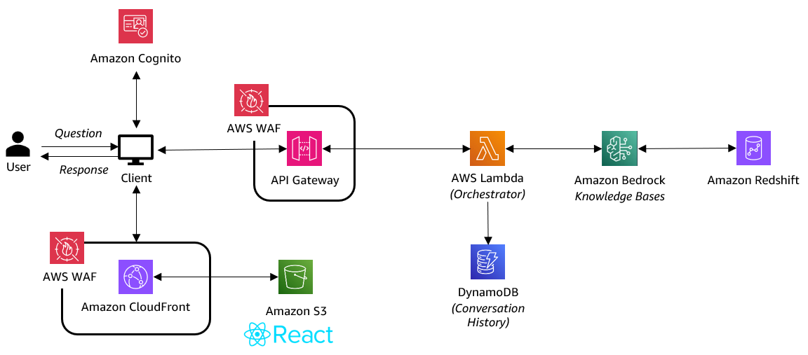
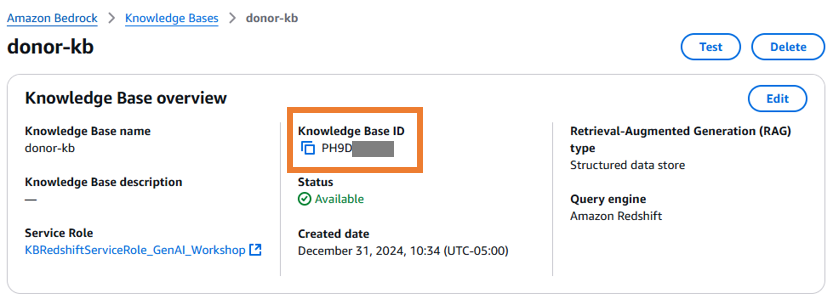

# Natural Language Query with Amazon Bedrock (React Single-Page Application)

## Overview

This sample shares how to deploy a React single-page application (SPA) with the AWS Cloud Development Kit (CDK) that hosts a chatbot for natural language query of structured data.

**NOTE:** This sample is designed for experimentation and is NOT recommended for use in production.

Screenshots of this demo are shown below.


---

## Architecture

There are four cdk stacks:

- AuthStack
  - Amazon Cognito
- DataStack
  - Amazon S3 bucket, Amazon DynamoDB, AWS Glue Crawlers, Amazon Athena
- APIStack
  - Amazon API Gateway, AWS WAF, AWS Lambda
- FrontendStack
  - Amazon CloudFront, AWS WAF, Amazon S3


1. AWS Glue crawls the data stores and adds schema and table metadata to the Glue data catalog.

2. The user is authenticated via Amazon Cognito.

3. The client fetches the static, single page application (SPA) hosted in S3. Client IPs are validated by the WAF.

4. The user submits a question through the React user interface.

5. The Cognito session authorizes a POST call to API Gateway. The WAF uses the standard ruleset to evaluate the traffic.

6. AWS Lambda receives the API gateway event and orchestrates the backend.

7. The conversation history is pulled from DynamoDB as context.

8. Amazon Bedrock uses the metadata from the data store + the user’s question as context to generate a SQL query. The SQL query is tested. If an error occurs, the LLM generates a new query and tests again. This retry loop can occur up to 3 times.

9. The generated SQL query is executed with Amazon Athena against the original data store.

10. The SQL query result is returned to Amazon Bedrock and is used as context to generate a conversational response to the user’s query.

11. The response is submitted through the front-end to the user.

## Directory Structures

```sh
.
├── backend          # CDK scripts for backend resources
└── frontend
    ├── provisioning # CDK scripts for frontend resources
    └── web          # React scripts
```

## Main Libraries

- @aws-amplify/ui-components
- @aws-amplify/ui-react
- aws-amplify
- aws-cdk
- aws-lambda
- jest
- react
- react-scripts
- ts-node
- typescript

## Prerequisites

Ensure that the following tools are installed before proceeding:

- **AWS CLI**: version `2.24.22` | [Installing the AWS CLI](https://docs.aws.amazon.com/cli/latest/userguide/getting-started-install.html)
- **AWS Profile**: AWS credentials permissions for relevant resources (listed above) | [Configure AWS Profile on the AWS CLI](https://docs.aws.amazon.com/cli/latest/userguide/cli-chap-authentication.html)
- **AWS CDK Prerequisites**: Node, Typescript | [Configure CDK Prerequisites](https://docs.aws.amazon.com/cdk/v2/guide/prerequisites.html)
- **AWS CDK**: version `2.1006.0` | [Getting Started with the AWS CDK ](https://docs.aws.amazon.com/cdk/v2/guide/getting_started.html)

---

## Let's Get Started!

### 1. Enable Amazon Bedrock model access

- Navigate to the [Amazon Bedrock console](https://console.aws.amazon.com/bedrock/home) and select `Model Access` at the bottom of the left navigation pane.
- Select `Enable specific model access` or `Modify model access` if you've visited this setting before.
- Check the `Claude 3 Sonnet` model under the Anthropic header. We'll use this model to generate SQL queries and return results in natural language. You are welcome to swap in an Amazon Bedrock model of your choice by updating the modelId field of the cdk.json file in the /backend directory.
- Select `Next` and choose `Submit`.

---

### 2. Clone the repository

- Run `git clone` command to download the source code
- Navigate to the Bedrock NLQ React directory

```bash
git clone https://github.com/aws-samples/nonprofit-samples.git
cd nonprofit-samples/Bedrock_NLQ_React_App

```
---

### 3. Bootstrap the AWS CDK

If this is your first time using the AWS CDK in your account, you will need to [bootstrap your environment](https://docs.aws.amazon.com/cdk/v2/guide/bootstrapping-env.html) so it is primed to deploy CDK projects.

Select the aws account and region where you are deploying your CDK project. The command will provision foundational resources (S3, IAM, ECR) for your CDK projects.

```bash
cdk bootstrap aws://{aws-account}/{aws-region}
```

### 4. Deploy backend resources

- Run `npm install` command in the [backend](backend) directory.

```bash
cd backend
npm install
```

- Run `cdk deploy --all` to deploy backend resouces.
  - Alternatively, you can deploy each stack individually like `cdk deploy AuthStack`.

```bash
cdk deploy --all
```

- When resouces are successfully deployed, outputs such as APIStack.CognitoUserPoolId will be shown in the terminal. These values will be used to deploy frontend resouces.

```sh
Outputs:
APIStack.CognitoUserPoolId = xxx
APIStack.CognitoUserPoolWebClientId = xxx
APIStack.ExportsOutputFnGetAttUserPoolxxx = xxx
...
Outputs:
AuthStack.apiEndpointxxx = xxx
```

---

### 5. Deploy frontend resources

#### 5.1 Build React app

- Run `npm install` command in the [frontend/web](frontend/web) directory.

```bash
cd Bedrock_NLQ_React_App/frontend/web
npm install
```

This React app uses environment variables to manage configuration settings. Follow these steps to set up your environment file:

- In the [frontend/web](frontend/web) directory, open the file named `.env.example`.
- Update the sample values for each variable using the outputs from your backend CDK stacks.

  1. Navigate to the [AWS Cloudformation console](https://console.aws.amazon.com/cloudformation/home)
  2. Select `AuthStack` from the list of completed stacks.
  3. From the `Outputs` tab, copy the `CognitoUserPoolId` and the `CognitoUserPoolWebClientId`.

     

  4. Next, select the `APISTack`.
  5. From the `Outputs` tab, copy the `apiEndpoint`.

     

- Add your output values to your environment variables in the `.env.example` file in the following format

  ```sh
  # .env
  VITE_USER_POOL_ID= Insert Cognito user pool ID from your AuthStack output

  VITE_CLIENT_ID= Insert Cognito client ID from your AuthStack output

  VITE_API_ENDPOINT=  API endpoint from your APIStack output

  ```

- Save your `.env.example` file and rename to `.env` so your application can access the configurations.

- Run `npm run build` in the same directory to build react scripts.

```bash
npm run build
```

---

#### 5.2 Deploy frontend resources

- Move to the [frontend/provisioning](frontend/provisioning) directory and run `npm install` command.

```bash
cd Bedrock_NLQ_React_App/frontend/provisioning
npm install
```

- Run `cdk deploy --all` to deploy frontend resouces.

```bash
cdk deploy --all
```

- When resouces are successfully deployed, FrontendStack.endpoint will be displayed in the terminal. You will access the app hosted on cloudfront/s3 by this url.

```sh
Outputs:
FrontendStack.endpoint = xxx.cloudfront.net
```

---

## Post-Deployment Instructions

### Create Cognito user

- In order to sign in the app, you need to create a new cognito user. You can create a user by AWS Management Console or AWS CLI.

### Creating a Cognito user in the AWS Console

1. Navigate to the [Amazon Cognito console](https://console.aws.amazon.com/cognito/v2/idp/user-pools)
2. Select the user pool that was created from your CDK project.
3. From the left menu under `User management` select `users`.
4. Select `Create user` from the top right.
5. Create a username that the user will use to login, then set or generate a password.

   

6. Select `Create user`. Use the credentials to enter the application using the Cloudfront URL.

## Experimenting with the Chatbot

### Sample Data

The sample dataset follows a dimensional model of synthetic donor data. Donation transactions are stored in a central fact table with auxillary information like donors, events, campaigns and payment method stored in dimension tables.


### Sample Questions

Try some of the following sample questions to test the chatbot in it's SQL generation and execution skills. Navigate to the Cloudwatch logs of the ApiStack Lambda function to review more detailed logging.

1. Which campaign had the highest total donation amount?
2. What payment method was used most frequently?
3. List the top 3 events that generated the most donations.
4. List the top 3 donors for the campaigns that generated the most donations overall.

### Updating the Model ID

The Bedrock calls use the [Bedrock Converse API](https://docs.aws.amazon.com/bedrock/latest/APIReference/API_runtime_Converse.html) which makes it easier to sub in new model IDs without having to account for the variety of response structures.

To update the model ID, navigate to the cdk.json file in the /backend directory and update the `modelId` field with a model ID from the list of [available Bedrock model IDs](https://docs.aws.amazon.com/bedrock/latest/userguide/models-supported.html).

Re-deploy the CDK backend following [Step 4](#4-deploy-backend-resources)in the above instructions.

---

## Improving Natural Language Query (NLQ) Performance

### Metadata retrieval

When running an NLQ pipeline, the most important contribution is metadata about your structured data so that the LLM has enough context to accurately structure SQL. There are multiple methods for retrieving data store metadata such as referencing flat file documentation, dynamically retrieving schema details, or leveraging RAG for vectorized metadata.

This project simply retrieves column name and data types from our crawled data in the AWS Glue Data Catalog via the AWS SDK. This works because the data is simple enough for the LLM to interpret by column name. However, if you want to add more data source context, consider structuring a text file with metadata that the LLM can reference instead. As your dataset matures and evolves, consider a RAG pipeline for metadata retrieval.

### Sample queries

Another component of our NLQ pipeline is supplying sample queries so that the LLM can learn how to strucutre SQL based on examples. Our Lambda function includes a sample_prompts.py file that lists a single sample query. This is injected into our prompt that's sent to the LLM, an example of few-shot prompting.

You can add more sample queries and test the resulting performance of the chatbot. This is useful if you expect users to ask similar questions and you want to guide the LLM to use a specific SQL query, or if you have a nuanced edge case that the LLM is struggling to compile SQL for.

## Chat History

Collecting and storing chat history is important for 1) maintaing relevant context during the user chat and 2) reviewing chat logs to trend user questions and analyze performance.

In this sample project, we use DynamoDB to store chat history for each chat session, which is defined as the period between page refreshes. Each time the page is refreshed, a new session ID is created and the chats are stored according to that session ID.

## Security

### Restrict Access by IP

The cdk.json file lists specific IPs to restrict access to your AWS resources through the AWS Web Application Firewall (WAF). By default the WAF allows all IPv4 traffic. Updates these IPs if neccesary.

- backend/cdk.json (API Gateway WAF IP Restriction)
- frontend/cdk.json (Cloudfront WAF IP Restriction)

## Testing

We use the Jest framework to build test cases for this CDK.

To run backend tests, simply run `npm test` to execute the test scripts in the [backend/test](backend/test) directory. By default, the test script checks a simple synthesis for each CDK stack Update this test script if neccesary.

## Troubleshooting

### API Gateway timeouts

Given the retry loop design, some queries may take longer than the 29 second API Gateway timeout setting to return a result. You may wish to increase the API Gateway timeout by updating the service quota titled `Maximum integration timeout in milliseconds`.

See [CONTRIBUTING](CONTRIBUTING.md#security-issue-notifications) for more information.

# Alternate Text-to-SQL Backend (Bedrock Knowledge Bases)

The default solution uses a custom text-to-SQL pipeline constructed with AWS Lambda, Amazon Bedrock, and Amazon Athena querying sample data in Amazon S3. As new Generative AI features are released there is more flexibility in managed text-to-SQL pipelines. Amazon Bedrock Knowledge Bases enables managed text-to-SQL pipelines with Amazon Redshift, reducing overhead when managing SQL generation, execution and session memory. This section of the CDK project shows how to swap in a [structured Bedrock Knowledge Base](https://docs.aws.amazon.com/bedrock/latest/userguide/knowledge-base-build-structured.html) in place of the custom pipeline.



## Prerequisites

### Amazon Redshift

Amazon Bedrock Knowledge bases connects to your Amazon Redshift data warehouse for the text-to-SQL pipeline. If you have an existing Redshift workgroup, proceed with the Amazon Bedrock Knowledge Base setup below.

If you would like to provision a sample Redshift cluster populated with our sample data, you can deploy the supplementary CDK stack in this project.

> **Note:** This CDK stack deploys a Redshift Serverless cluster and will incur cost. Learn more about [Amazon Redshift pricing](https://aws.amazon.com/redshift/pricing/)

1. Ensure the core CDK stacks have been deployed (AuthStack, DataStack, APIStack) following [Step 4](#4-deploy-backend-resources) in the above insructions.

2. Navigate to the /backend directory and run the deploy command for the supplementary RedshiftStack.

```bash
cd backend
cdk --app "npx ts-node --prefer-ts-exts bin/redshift-provisioning.ts" deploy RedshiftStack
```

### Setup Bedrock Knowledge Base Structured Data store

Follow the instructions available in [this AWS workshop](https://catalog.us-east-1.prod.workshops.aws/workshops/62f0a65f-2c83-418c-ab26-19cdbf53a392/en-US/kb-nlq) to configure Bedrock Knowledge bases with your Amazon Redshift cluster. These steps assume you are using the provided Redshift Serverless sample cluster, you may need to tweak them if you are using your own Redshift infrastructure.

> **Note:** The workshop console links default to `us-west-2`. Ensure you're in the region where your Redshift cluster resides.

The workshop section will walk you through:

1. Creating a database user with read access to your schemas and tables
2. Connecting the database user with the IAM service role created in the CDK app
3. Creating a Bedrock Knowledge Base for structured data using the created IAM service role

For alternate setup instructions, refer to the AWS Documentation for how to [Build a knowledge base by connecting to a structured data store](https://docs.aws.amazon.com/bedrock/latest/userguide/knowledge-base-build-structured.html)

## Configure the CDK App to Use Bedrock Knowledge Bases

Once you have your Bedrock Knowledge Base configured to read from your structured data store, you can configure your CDK app to use the Knowledge Base instead of your custom text-to-SQL pipeline.

1. Navigate to the `cdk.json` file in the root of your /backend directory.
2. Update the `nlqPipelineMode` to `KB` instead of the default `S3`.

> **Note:** Setting the `nlqPipeline` variable to `S3` will use your custom text-to-SQL pipeline configured with AWS Lambda, Amazon Bedrock and Amazon Athena with the sample CSV data in Amazon S3. Setting the variable to `KB` will shift the backend logic to use your Amazon Bedrock Knowledge Base.

3. Navigate to your Knowledge Base in the Amazon Bedrock Console and retrieve the `Knowledge Base ID`. Paste this value in the `BedrockKnowledgeBaseId` variable in the `cdk.json` file.



_Sample cdk.json file_

```sh
{
  "app": "npx ts-node --prefer-ts-exts bin/provisioning.ts",
  "context": {
    "allowedIpAddressRanges": ["0.0.0.0/1", "128.0.0.0/1"],
    "modelId": "us.anthropic.claude-3-sonnet-20240229-v1:0",
    "nlqPipelineMode": "KB", 
    "BedrockKnowledgeBaseId": "XXXXXXX"
  }
}
```

## Redeploy the backend with updated configuration

Follow [Step 4](#4-deploy-backend-resources) in the above insructions to redeploy the backend resources with our updated `cdk.json` variables. This will swap in a new Lambda orchestrator function backing our API Gateway.

Your front end will remain unchanged - continue experimenting from the Cloudfront URL deployed as an output in the `FrontendStack`!

# Deleting Resources 

If you've deployed the Redshift extension, you'll need to delete this stack first before deleting the remainder of the core stack. 

1. Delete the `RedshiftStack` from the backend directory

```bash
cd backend
cdk --app "npx ts-node --prefer-ts-exts bin/redshift-provisioning.ts" destroy RedshiftStack
```

2. Delete the core stacks from the backend 

```bash
cd backend
cdk destroy --all 
```

3. Delete the front end stacks from the frontend/provisioning directory

```bash
cd frontend/provisioning 
cdk destroy --all
```
> **Note:** You will need to manualy delete your Amazon Bedrock Knowledge base as this was created outside the CDK deployment. 

## License

This library is licensed under the MIT-0 License. See the LICENSE file.
