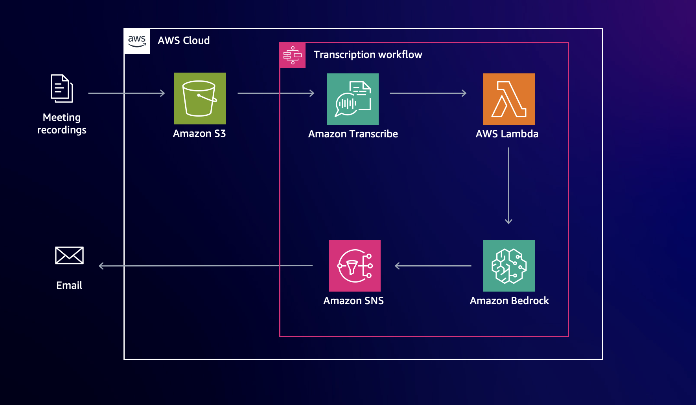

# Meeting summarization

[This solution](meeting-summarization.yml) creates a meeting summary and action items for a recorded meeting. 

Install the solution via CloudFormation. Enter an email address to use to receive notifications.

Once the stack is complete, go to the **Outputs** tab and note the name of the **BucketName** field listed. This is the bucket where you need to drop new recordings.

Once you drop a recording in the bucket, the solution kicks off a step function, which transcribes the meeting, sends the transcription to Claude v2, and sends the results to an SNS topic (which you subscribed to).

When you upload a video, make sure to select an encryption key. You can select your own enryption key or select the bucket settings for default encryption. 

Most meetings are transcribed in a matter of minutes.

Below is a summary of an email you might receive:

