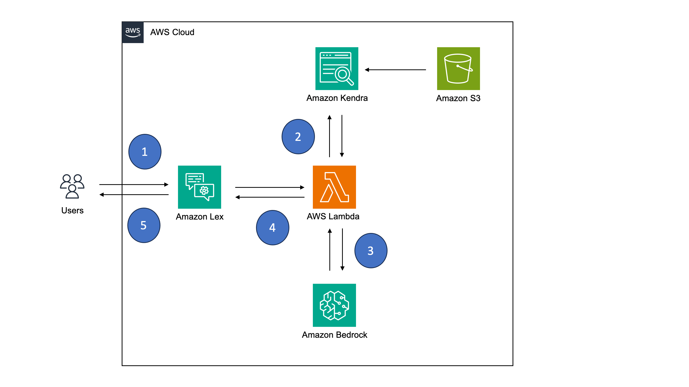

## RAG Chatbot

This sample uses the retrieval agumented generation (RAG) pattern to create a chatbot that can be used for a variety of purposes. 

### Architecture

The architecture of the solution is as follows:



1. A user sends a request off to a chatbot
2. The Lex chatbot receives the request and sends it off to a Lambda function. The Lambda function sends the user's query to an Amazon Kendra index to find content that matches the user's question. The Kendra index is populated by custom data provided by the organization and uploaded to Amazon S3. 
3. The Lambda function receives a response back from Kendra and then sends a request off to Amazon Bedrock. It asks Amazon Bedrock to answer the user's question, using only the context provided by Amazon Kendra. 
4. Amazon Bedrock returns a response, which AWS Lambda sends back to the Lex chatbot
5. The Lex chatbot receives the results from the Lambda function and sends it on to the user to answer their question

### Steps to deploy

1. The chatbot requires a Lambda layer that included the latest boto3 (1.28.57 or above) and botocore (1.31.57 or above) libraries. Create a layer as follows:

```
mkdir -p package/python
pip install boto3 botocore -t package/python
cd package
zip -r ../boto3-layer.zip .
```

Upload the layer to the Lambda console under *Layers*. Note the ARN and use it in the next step.

2. Deploy the [CloudFormation template](rag-chatbot.yml). Add the Lambda Layer ARN to the **BotoLayerArn** parameter. The deployment will take about 25-30 minutes to complete
3. Once complete, click on the CloudFormation **Outputs** tab. The value for the **S3Bucket** key is the S3 bucket where your content should be added. 
4. Go to the S3 console, find the bucket, and place your content in this bucket. 
5. Go to the Kendra console. Find the Kendra index that was created (it should be named {*stack-name*}-index, where *stack-name* is the name of your CloudFormation stack). Click the index name. In the left naviation that appears, click on **Data sources**. Click the radio button next to the index listed and click the **Sync now** button. After a few minutes, the content you added to S3 will be indexed and available to query via Kendra.
6. Go to the Lex console and click the link for the Bot (it should be named *{rag-chatbot}*-bot,where *{rag-chatbot}* is the name of your CloudFormation stack). 
7. From the left naviation, select **Intents**. It is available under **Bot versions** -> **Draft version** -> **All languages** -> **English (US)** -> **Intents**
8. In the **Intents** screen, click the **Build** button. Wait for the Lex bot to be built, then click **Test** to test the bot. 