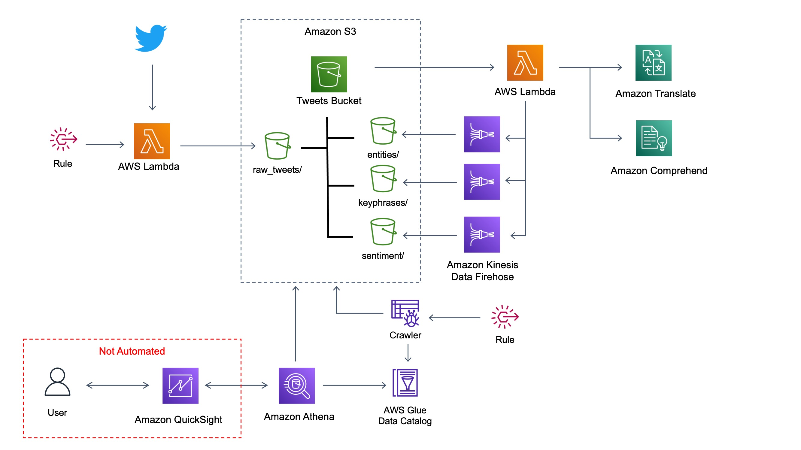
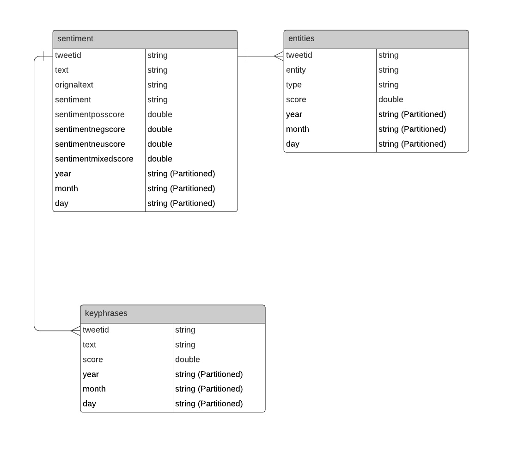

# Social Media Sentiment Project

This project sets up the necessary resources to create a social media sentiment monitor. The architecture for this solution is as follows.

To deploy, simply launch the CloudFormation template. 

The "Not Automated" section shown in the architecture is not included in this project. 

## Data Model 
The data model that is created is as follows.

The **sentiment** table contains the original text and translated text (if applicable) for the tweet and the sentiment information. This table can be used to determine the sentiment level (positive, negative or neutral) of the tweet.

The **entities** table contains the tweetid (to link back to the original tweet in the **sentiment** table), and the entity information for that tweet. This table can be used to see what entities are being referenced in the tweets.

The **keyphrases** table contains the tweetid (to link back to the original tweet in the **sentiment** table), and the key phrases used in that tweet. This table can be used to create a word bubble for different types of sentiment.

## Deploying

To use this solution, you must:
- Create and provide a [Twitter bearer token](https://developer.twitter.com/en/docs/authentication/oauth-2-0/bearer-tokens)
- Provide the Twitter user name you want to track. For example, entering **AWS** will track all mentions of the @AWS twitter handle

## Notes

This project is a combination of the following solutions:
- [AI-Driven Social Media Dashboard](https://aws.amazon.com/solutions/implementations/ai-driven-social-media-dashboard/). 
- [Customer Sentiment Immersion Day](https://immersionday.com/customer-sentiment-immersion-day). 

When you deploy this project, the code uses the Twitter API in conjunction with the bearer token you provided to find the Twitter user id for the Twitter user name you provided. When you search for tweets, Twitter's APIs require you search based on the user id (which is different from the Twitter user name), and finding the user id isn't very intuitive for most users. The installation step makes it so users don't have to worry about finding the Twitter user id.

The bearer token is stored in Secrets Manager and the twitter user id is stored in Systems Manager Parameter Store. 

There are two EventBridge rules that fire 1x daily. The first rule calls a Lambda function that pulls all tweets for the specified user from the previous day. An S3 bucket trigger calls another Lambda that parses the new data, translates it (if necessary), performs comprehension analysis on it, and dumps it back out (via Kinesis Data Firehose) to some folders in the original bucket. The second EventBridge rule fires about an hour after the first rule. This rule kicks off a Glue crawler job, the only purpose of which is to re-index the data so any new partitions (for year, month, and day) are added to the data catalog. This step essentially makes the new data visible to Athena and other services.