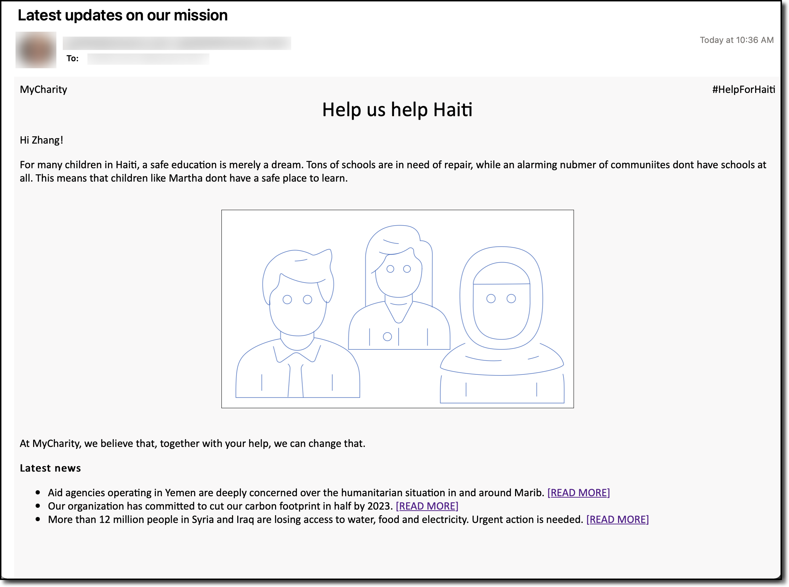
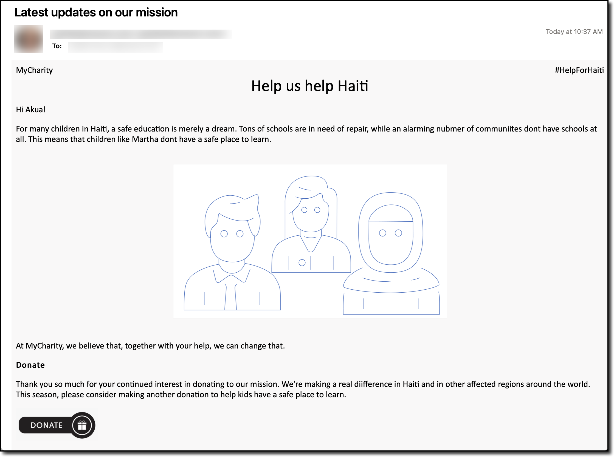

# Targeted Messaging with Amazon Pinpoint and Amazon Personalize

The [installer](install.sh) sets up the necessary infrastruture to demonstrate how to create a targeted messaging platform with Amazon Pinpoint and Amazon Personalize. The installer uses both CloudFormation and bash/python because Amazon Personalize doesn't (yet) support CloudFormation and Amazon Pinpoint doesn't (yet) have great CloudFormation support.

The architecture for this solution is as follows.

To deploy:
- Go into `install.sh` and modify lines 10 and 11 to set the email address and stack name you want to use.
- Run `./install.sh`

The installer will use the default AWS profile (including default region) you have set up in `~/.aws/credentials`. 

**NOTE**: The installer takes about 2 hours to run. 99% of the time is training the Amazon Personalize model. If you kill the job half way through, you'll need to re-start it from the beginning so Personalize can fully train the model.

## Amazon Personalize
I built the [UserInteractions.csv](UserInteractions.csv) file to contain the interactions needed to build an Amazon Personalize model. In the data I created, there are 30 users (user_0 through user_29). Each user engaged with one of five different elements on a fictional nonprofit website. Those five elements (recorded in the file) are `GET_INVOLVED`, `EVENTS`, `DONATE`, `MEMBER_BENEFITS`, and `NEWS`. An Amazon Personalize model is set up, reads in this dataset, and then will make predictions on what a user will want to interact with. 

If you want to create more data (or modify the existing data), the file I used to create the UserInteractions.csv file is called [generate_file.py](./support/generate_file.py). 

## Amazon Pinpoint
Amazon Pinpoint is used to send targeted messages to an end user. There are a few pieces to Pinpoint:
- The installer creates a file called pinpoint-users.csv. This file uses the `EMAIL_ADDRESS` field in the installer to create the data for a Pinpoint **segment**. A segment is basically a group of people you want to send a message to. Pinpoint has confusing terminology, like **endpoint**, which just represents the location where you're sending the message. For example, a user's email address is considered an endpoint. 
- The installer sets up an email template that you can use to send targeted messages. I set up a sample template that talks about helping out some school kids in Haiti.
- The email template uses the Amazon Personalize model that was created to customize messages for each user. Based on what Amazon Personalize recommends for each user, they'll get slightly different content in their email message.

## Results
Once the installer is complete, you should receive 6 messages. The first message is from SMS, asking you to confirm your email address. The rest of the messages are the demo messages for the solution (which are sent by Pinpoint). Each message is to a different person and show how each message was personalized for that user.

To send a new batch of messages, you can go into the Pinpoint project, select **Campaigns** and either create a new campaign or duplicate the existing campaign. 

## Sample Message
Here's an example message that someone could receive. Notice how the content changes in both emails. This customization is done via the Amazon Personalize model (and an AWS Lambda function to make the output pretty).

Sample 1:

Sample 2:

